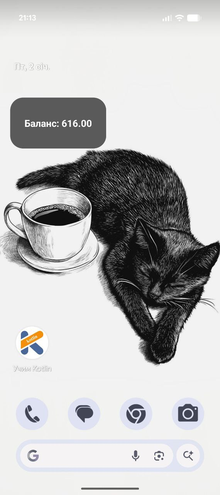
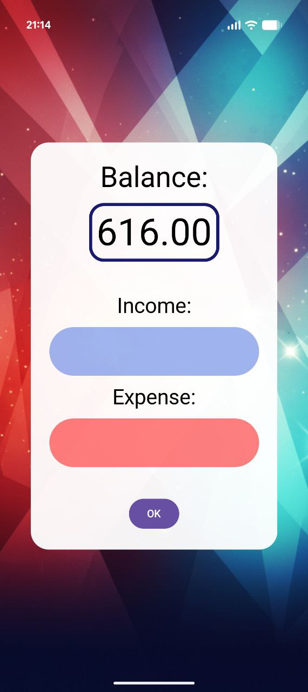

A simple and stylish Android application for tracking personal finances with a dedicated home screen widget. This project demonstrates working with Android UI, data management, and the AppWidgetProvider API.
This application was developed as part of my journey in learning Android development.

  
  

This application was developed as part of my journey in learning Android development.
